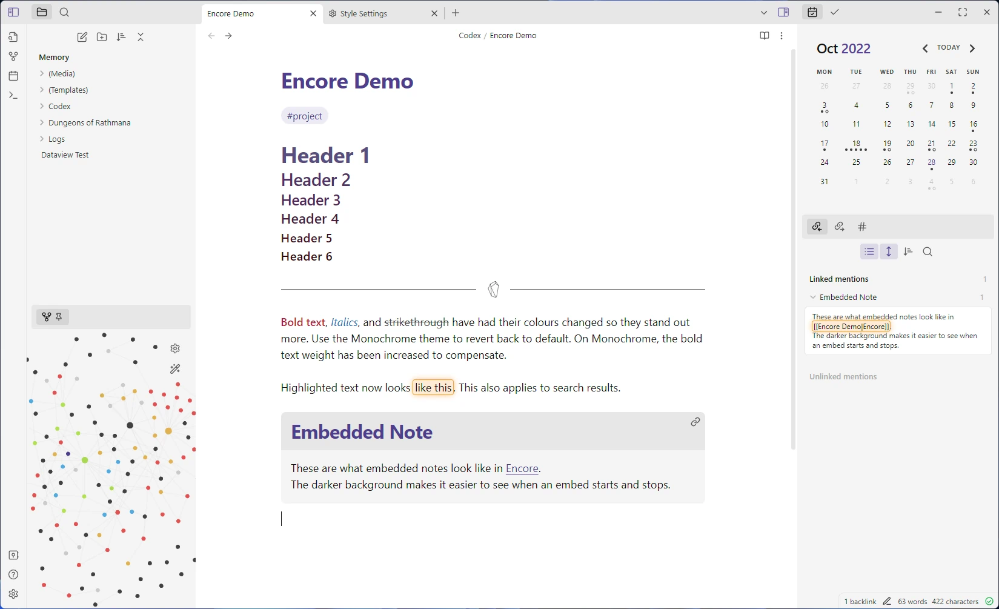
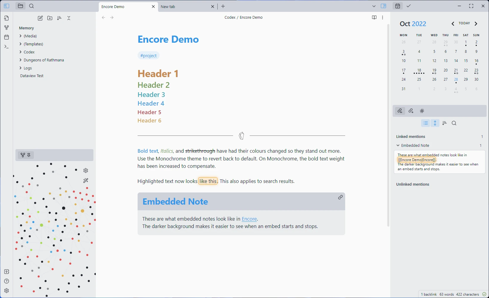
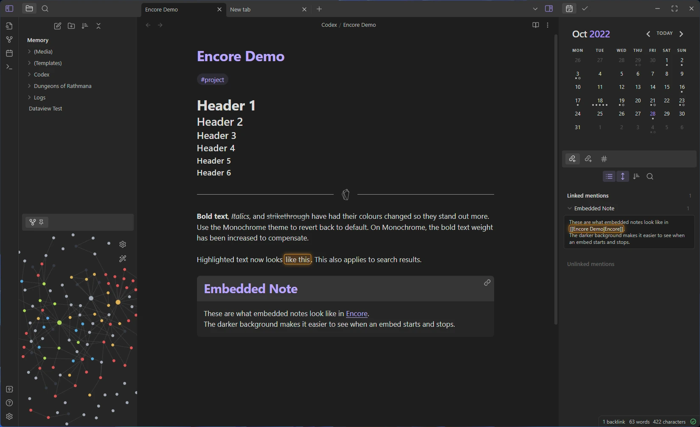
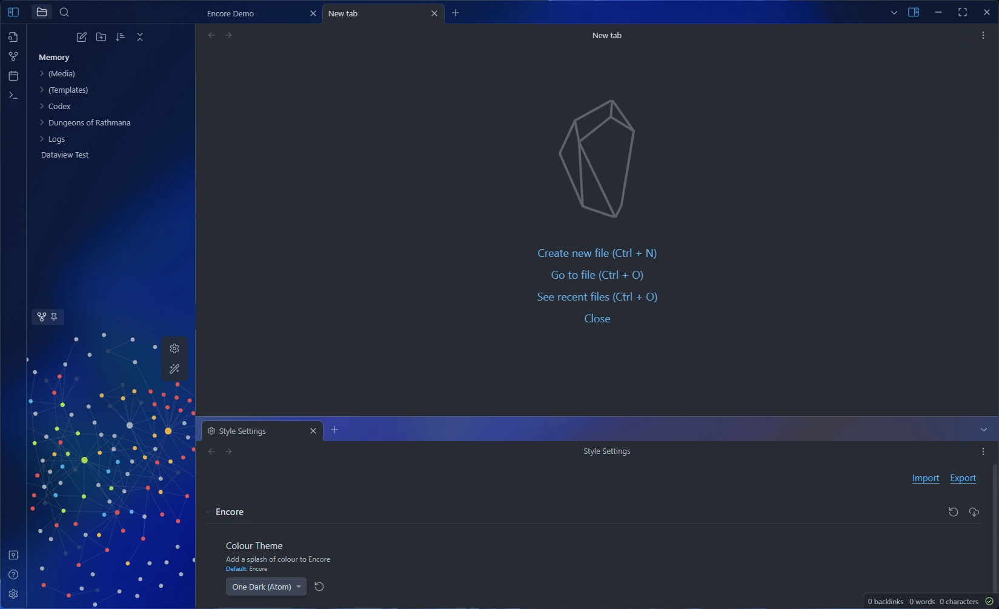

# Encore - A More Sleek Default Theme

Encore aims to keep the default feel of obsidian, while *polishing up the interface* and *adding a touch of style*.

Encore keeps Obsidian's colours by default, but you can use the [Style Settings](https://github.com/mgmeyers/obsidian-style-settings) plugin to switch it up! You can find the plugin in the community plugins tab. Thanks to *mgmeyers* for creating it :)

## One Dark (Atom)
The legendary One Dark theme is here

## Monochrome
Same as default, but with reduced colours

## Translucent
The Translucent option has been given a bit of love. All dark themes support Translucency!

## Your favourite theme here?
I'm always on the lookout for new awesome colour themes to add!

---

## Goals
1. Stay true to the default theme
2. Increase usability, make things easier to parse visually
3. Polish the interface
4. A little bit of flair where appropriate :)

# 1. Staying True
Obsidian is already a great looking app, this theme will only build upon it, without making any drastic changes.
By default, the original colour palette has been kept. You can change this by using the **Style Settings Plugin** to use one of the popular colour palettes included with Encore.

### 2. Increasing Usability
I recommend dark theme enjoyers use a lighter accent colour to make coloured text more readable on a dark background, and light theme users should use a darker accent colour. Text that appears on coloured backgrounds (like buttons) has been changed to be dark, for better contrast there.
- Many lines found around the interface have been removed, less visual noise to process.
- Embedded notes are now wrapped in a box, so you can easily tell where the embedded note starts and ends.
- The resize bars have been made bigger, easier to click on now. You'll also never try to resize a horizontal line again, as resize bars look different now (you can't see them lol)
- The collapse and expand buttons have been coloured in, as they are different to the other buttons, makes them easier to find
- While in reading mode, the button to edit is coloured, because understanding a colour is faster than an icon (easier to differentiate at a glance). I will find more ways to distinguish reading mode in the future.
- The default accent colour has been changed to `#BAA5FD`. It's the same shade as the default, but slightly lighter to make it easier to read on a dark background

### 3. Polishing Things Up
The default obsidian theme is already quite polished, so there's not much I can do here. The biggest changes can be found when translucency is enabled, I cleaned up that mode quite a bit. I think it's quite pleasant to use now!

### 4. Spicing Things Up
A little bit of visual flair never hurts :)
- The new tab page has been redesigned to match Visual Studio Code's empty workspace  state.
- Resize bars have been made fancier, taking cues from the gesture bar on smartphones.
- Transparency mode is now *chefs' kiss*

# Installation
Copy `obsidian.css` into your themes folder (there's a link to it in the app), you might want to rename it to **Encore.css** so you can see it's name in the theme browser.

# Known Issues
- Stacked tabs mode is broken
- Translucency while using light theme has bad text colours

# How to Edit
**Note to self in case I forgor**

You'll need node.js, since I'm using SASS.

1. Clone the repo, and run `npm install`
2. Use `npm run dev` to make SASS watch for changes and compile to `themes/Encore.css`
3. Create a symbolic link from this themes folder over to the actual themes folder in Obsidian
4. Edit the files inside `./source`

That's just the way I've set it up, you can also follow [this article](https://publish.obsidian.md/hub/04+-+Guides%2C+Workflows%2C+%26+Courses/Guides/Want+some+Sass+with+your+obsidian+theme%E2%80%BD+here's+How+and+Why) if you want to see another, simpler way.

The symbolic link is there so built css files are loaded straight into obsidian.