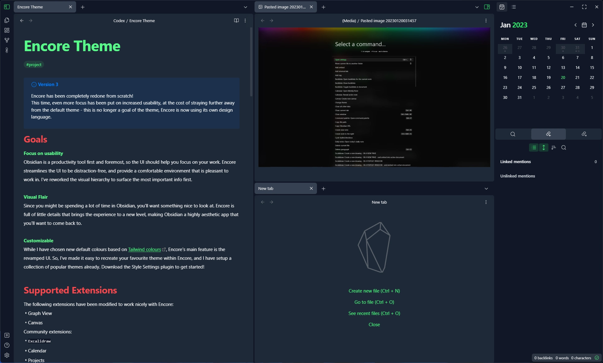
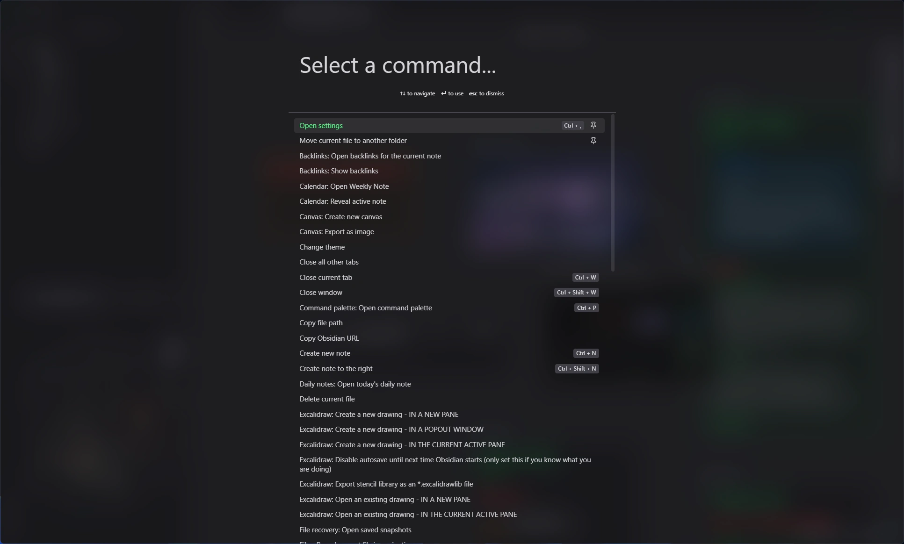

# Encore - A Fresh Take on Obsidian

*Font: Rubik (not included)*
Unlike most themes which mainly change the colors of the base theme, Encore makes some drastic changes that paint Obsidian in a new light - while still feeling familiar and easy to navigate.
> **That sound contradictory, how?** Encore retains your muscle memory by keeping everything in the same spot. Instead we make big changes to the ==visual hierarchy== of the app! Basically, if you squint, which elements stand out the most?

At the same time, Encore adds a few *visual flairs* to the app, making Obsidian even more delightful to use! Here are some examples:
- Return of **transparency mode**! I highly recommend trying it out.
- Overhauled quick open / command palette that is sure to make an impression
- Subtle **film grain** in the background, mimicking the official obsidian website
- New horizontal lines featuring the logo. Feels like a fancy book!
- The iconic **fancy header**, taking a page from Safari's book
- Kick things up to 11 with the **RGB Theme**, featuring actual animated RGB. Use Style Settings to enable

*Yes, it really is this good.* 

---
# Typography Changes
For an app focused around text, it is *critical* that typography is taken into consideration. Personally, I find the defaults to be too tight. Encore's typography is based off the [Tailwind typography plugin](https://play.tailwindcss.com/uj1vGACRJA?layout=preview), designed by experts in the field. In fact, Encore as a whole was created after I read their book on UI design, as a means of applying my new knowledge.
> You can disable the typography changes if you don't like how your old notes look - generally you'll need far fewer empty line breaks as Encore adds plenty of spacing between paragraphs.
# Colors
By default, Encore uses a color palette based on the official Obsidian website (*Obsidian Redux*), keeping things familiar yet fresh. Or, by using the **Style Settings plugin**, you can choose between a handful of color palettes I've put together.
## Obsidian Redux
Encore's new default palette keeps things familiar yet fresh - a new take on the original color palette.

# Header 1
## Header 2
### Header 3
#### Header 4
## Cobalt
Encore's old default palette is swathed in a cold, metallic blue, with striking green accents. A staple of Encore's collection. Based on Tailwind's *Gray* color swatch.

## Mercury
Lighter and slightly more colorful than Obsidian Redux, where the grays have a slight blue tint. Based on Tailwind's *Zinc* color swatch.

## Iron
If you're a fan of warmer colors, Iron was made for you. Based on Tailwind's *Stone* color swatch.
## Carbon
There are no shadows, merely the absence of light.

## Blackout
With fervent devotion, the cult of the OLED bask in the total and absolute darkness, forging an eternal bond with the enigmatic depths of existence. Utilizes true black in the editor window.
## Obsidian
Even closer to Obsidian's default theme than Obsidian Redux, utilizing the exact same colors in some parts of the UI.
## Atom
The iconic Atom theme has made its debut in Encore
## RGB
Where the trinity of vibrant realms converges, weaving an electrifying tapestry that celebrates the ever shifting harmony of red, green, and blue. **Obsidian's one and only RGB theme**. Colors based on Carbon.

Truly one of the greatest themes to exist of all time.
## Sterling
Encore's light theme for flashbang enjoyers.

---
# Dev Setup
1. Run `npm i` and `npm run dev` to get started
2. Open up this repository as an obsidian vault