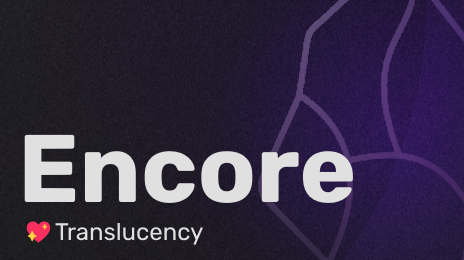

# Encore - An Obsidian Theme
The Encore theme aims to freshen up the UI of Obsidian.md with modern design, **while staying true to the original feel of the app** (at least in my opinion lol). It's loosely based off Material 3.

## Design Philosophy
The goal was to recreate the default theme, but with a more refined and modern look.
The colour palette has been tweaked slightly; the greys now contain a touch of purple, and the accent colour was made warmer and more vibrant.

Usability is my biggest concern, I made sure to keep a good separation and contrast between things so you can quickly find what you're looking for.

The design of the main surfaces are kept fairly muted to stay out of your way,
but things that aren't often on screen were made more vibrant, such as the right click menu and command palette.

I like this contrast, keeps things fresh while using the app.

# My To-Do List
I iterate on this theme as I use it, and whenever I get free time.
Here's a list of things I want to change:

**App UI**
- [x] Main workspace area
- [x] Resize handles (proud of this one 😎)
- [x] Tabs
- [x] Settings page
- [x] File browser
- [x] Command palette
- [x] Right click menu
- [ ] Fix search box
- [ ] [Checklist plugin](https://github.com/delashum/obsidian-checklist-plugin)
- [ ] Mobile support
- [ ] Light theme

**Markdown**
- [x] Headers
- [x] Top level header
- [x] Highlights
- [x] Embedded notes
- [x] Checkboxes
- [ ] Bullet lists
- [ ] Bold
- [ ] Italics
- [ ] Strikethrough

# Installation
Copy `obsidian.css` into your themes folder (there's a link to it in the app), you might want to rename it to **Encore.css** so you can see it's name in the theme browser.

# How to Edit
**Note to self in case I forgor**

You'll need node.js, since I'm using SASS.

1. Clone the repo, and run `npm install`
2. Use `npm run dev` to make SASS watch for changes and compile to `themes/Encore.css`
3. Create a symbolic link from this themes folder over to the actual themes folder in Obsidian
4. Edit the files inside `./source`

That's just the way I've set it up, you can also follow [this article](https://publish.obsidian.md/hub/04+-+Guides%2C+Workflows%2C+%26+Courses/Guides/Want+some+Sass+with+your+obsidian+theme%E2%80%BD+here's+How+and+Why) if you want to see another, simpler way.

The symbolic link is there so built css files are loaded straight into obsidian.

## Note on code
I only just started using sass, I used it to split it into different files.
I'll start to use sass features from now on.

Code quality should start improving now that I have actual tooling.

## Code Structure

- `source/app` contains styles that affect the app as a whole, like the title bar, status bar, and settings pages
- `source/components` are for individual things like the file explorer, calendar, todo list, and so on
- `source/md` have styles that affect the markdown preview
- `source/workspace` are styles for the overall layout of the main UI, and things shared by components (like the tab header)

Each folder has a `.scss` file with its name. This is the **import file**, that has a `@use` for the other scss files in the folder.  
It's also a place to store snippets of scss.

The `main.scss` file defines all important global variables, if you want to make a colour variation of this theme, you can edit this one. It also imports all of the other import files mentioned above. This is the file that we compile.